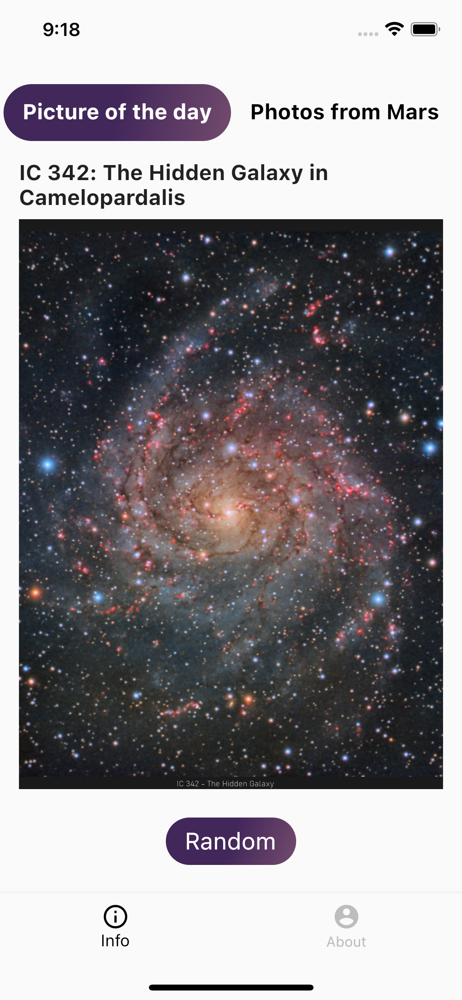
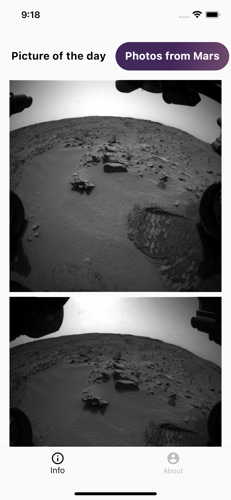

# Nasa app
An application which realized architecture with help of Elementary package

## Table of contents
* [General info](#general-info)
* [Screenshots](#screenshots)

## General info

Nasa App. Application that connects to the NASA API. The main goal is to realise architecture with
help of Elementary package made by Surf. The application consists of two screens, one of which
consists of two tabs with information received from the NASA API.

## Screenshots

	
	
	

