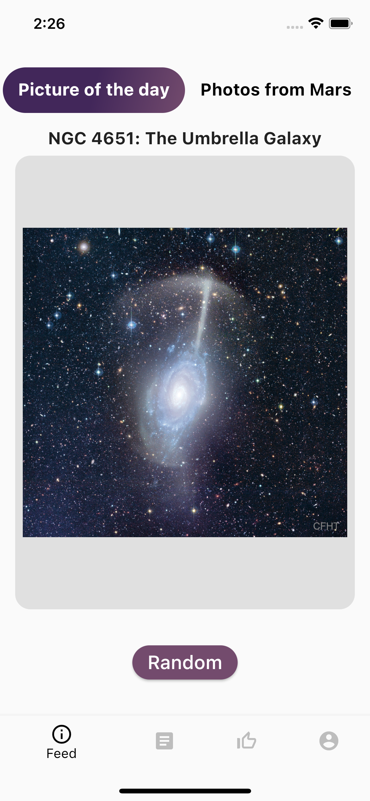

# Nasa app
An application which realized architecture with help of Elementary package

## Table of contents
* [General info](#general-info)
* [Screenshots](#screenshots)

## General info

Nasa App. Application that connects to the [NASA API](https://api.nasa.gov/) and [SpaceFlightNews API](https://www.spaceflightnewsapi.net/).
The main goal is to realise architecture with
help of Elementary package made by Surf. The application consists of four screens, one of which
consists of two tabs with information received from the NASA API. Among others, it is necessary to note such screens as:
Favorite screen, Articles screen, Image screen, About app screen and WebView screen for watching web content about articles.

## Screenshots

	
	
	
	
	
	
	

